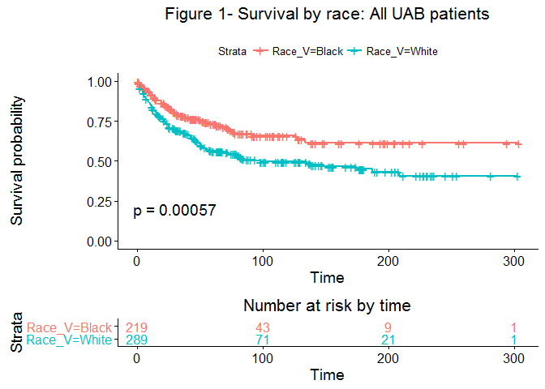
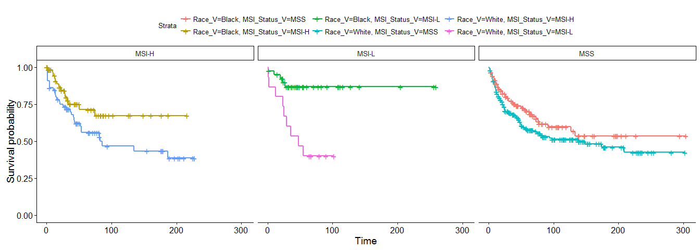
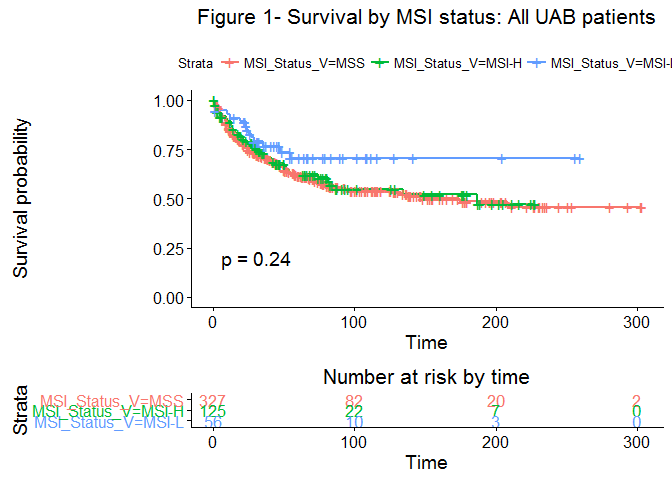
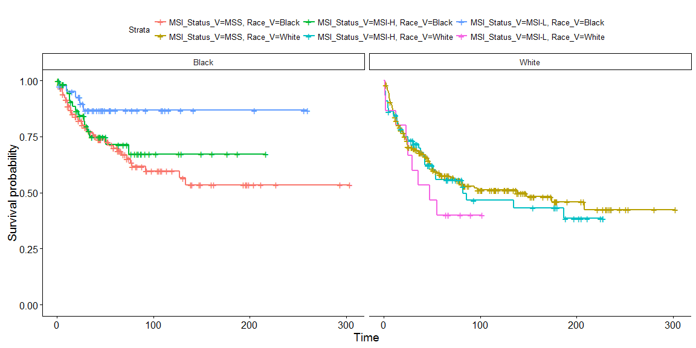
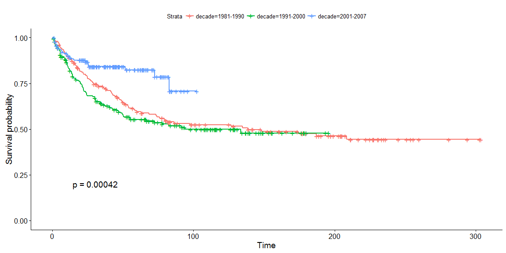
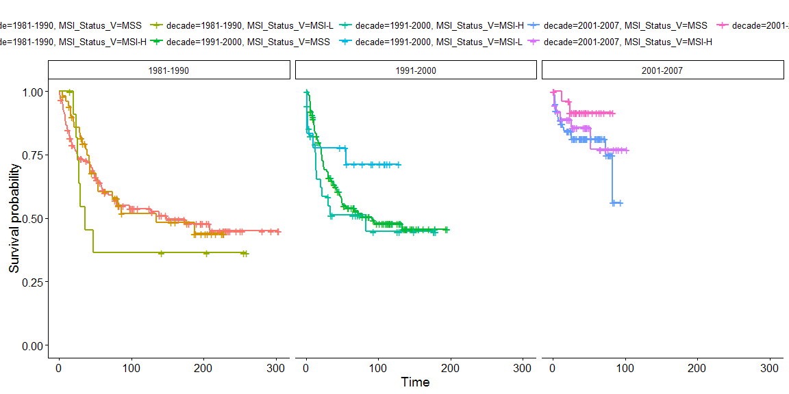
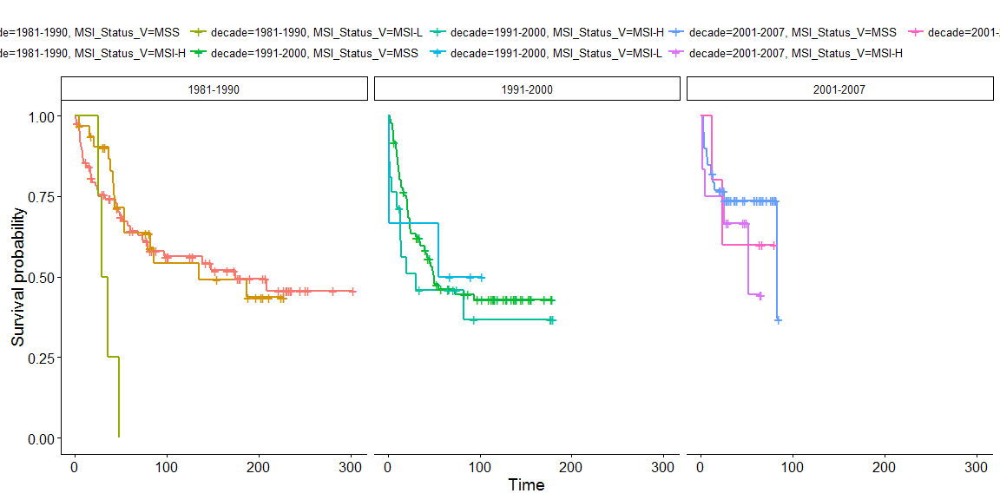
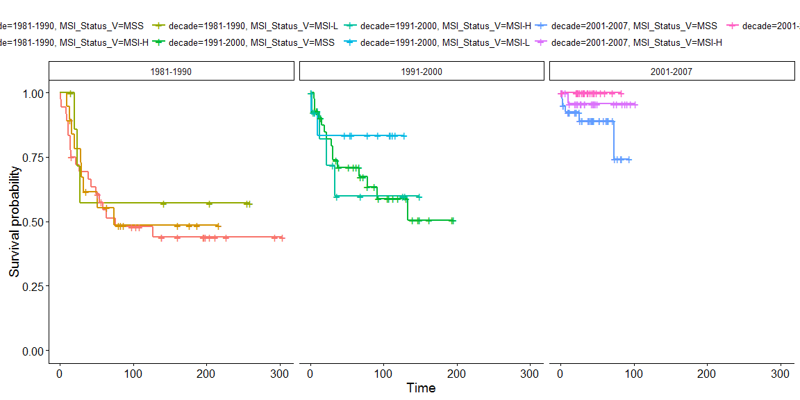
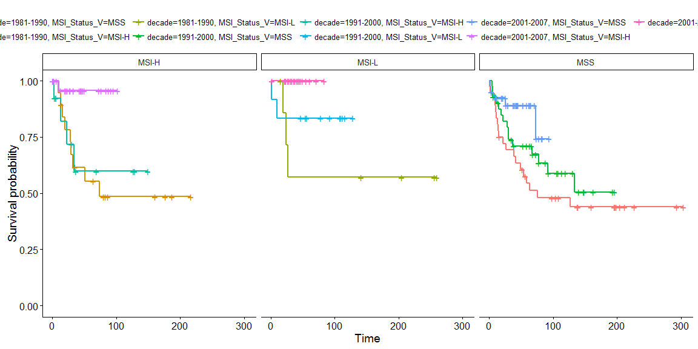

MSI analysis update
================

Table S1. Clinicopathological and molecular features by exclusion status
------------------------------------------------------------------------

-   Included patients had a higher proportion of rectal cancer
-   Excluded patients had slightly more proximal and distal
-   A larger proportion of excluded patients came from 1991-2000 decade of diagnosis
    (follow up months should differ because missing or incomplete f/u is a condition for exclusion)

<head>

</head>
<table align="center" style="border-collapse: collapse; caption-side:top; font-size:11pt;">
<caption style="text-align:center;">
</caption>
<tr>
<th <th align="center" style="font-weight: normal;border-left: 0px solid black;border-bottom: hidden;border-top: 2px solid gray;">
</th>
<th <th align="center" style="font-weight: normal;border-left: 0px solid black;border-bottom: hidden;border-top: 2px solid gray;">
exclude
</th>
<th <th align="center" style="font-weight: normal;border-left: 0px solid black;border-bottom: hidden;border-top: 2px solid gray;">
included
</th>
<th <th rowspan="2" align="center" style="font-weight: normal;border-left: 0px solid black;border-right:0px solid black;border-bottom: 1px solid gray;border-top: 2px solid gray;">
p
</th>
</tr>
<tr>
<th align="center" style="font-weight: normal;border-left: 0px solid black;border-bottom: 1px solid gray;">
</th>
<th align="center" style="font-weight: normal;border-left: 0px solid black;border-bottom: 1px solid gray;">
(N=130)
</th>
<th align="center" style="font-weight: normal;border-left: 0px solid black;border-bottom: 1px solid gray;">
(N=518)
</th>
</tr>
<tr>
<td align="left" style="border-left: 0px solid black;">
Race\_V
</td>
<td align="center" style="border-left: 0px solid black;">
</td>
<td align="center" style="border-left: 0px solid black;">
</td>
<td align="center" style="border-left: 0px solid black;border-right:0px solid black;">
0.086
</td>
</tr>
<tr>
<td align="left" style="border-left: 0px solid black;border-top: hidden;">
    Black
</td>
<td align="center" style="border-left: 0px solid black;border-top: hidden;">
50 (38.5%)
</td>
<td align="center" style="border-left: 0px solid black;border-top: hidden;">
225 (43.4%)
</td>
<td align="center" style="border-left: 0px solid black;border-right:0px solid black;border-top: hidden;">
</td>
</tr>
<tr>
<td align="left" style="border-left: 0px solid black;border-top: hidden;">
    Other
</td>
<td align="center" style="border-left: 0px solid black;border-top: hidden;">
1 ( 0.8%)
</td>
<td align="center" style="border-left: 0px solid black;border-top: hidden;">
0 ( 0.0%)
</td>
<td align="center" style="border-left: 0px solid black;border-right:0px solid black;border-top: hidden;">
</td>
</tr>
<tr>
<td align="left" style="border-left: 0px solid black;border-top: hidden;">
    White
</td>
<td align="center" style="border-left: 0px solid black;border-top: hidden;">
79 (60.8%)
</td>
<td align="center" style="border-left: 0px solid black;border-top: hidden;">
293 (56.6%)
</td>
<td align="center" style="border-left: 0px solid black;border-right:0px solid black;border-top: hidden;">
</td>
</tr>
<tr>
<td align="left" style="border-left: 0px solid black;border-top: hidden;">
AGE\_MB
</td>
<td align="center" style="border-left: 0px solid black;border-top: hidden;">
</td>
<td align="center" style="border-left: 0px solid black;border-top: hidden;">
</td>
<td align="center" style="border-left: 0px solid black;border-right:0px solid black;border-top: hidden;">
1.000
</td>
</tr>
<tr>
<td align="left" style="border-left: 0px solid black;border-top: hidden;">
    ? 65
</td>
<td align="center" style="border-left: 0px solid black;border-top: hidden;">
66 (50.8%)
</td>
<td align="center" style="border-left: 0px solid black;border-top: hidden;">
265 (51.2%)
</td>
<td align="center" style="border-left: 0px solid black;border-right:0px solid black;border-top: hidden;">
</td>
</tr>
<tr>
<td align="left" style="border-left: 0px solid black;border-top: hidden;">
    &lt; 65
</td>
<td align="center" style="border-left: 0px solid black;border-top: hidden;">
64 (49.2%)
</td>
<td align="center" style="border-left: 0px solid black;border-top: hidden;">
253 (48.8%)
</td>
<td align="center" style="border-left: 0px solid black;border-right:0px solid black;border-top: hidden;">
</td>
</tr>
<tr>
<td align="left" style="border-left: 0px solid black;border-top: hidden;">
Sex\_V
</td>
<td align="center" style="border-left: 0px solid black;border-top: hidden;">
</td>
<td align="center" style="border-left: 0px solid black;border-top: hidden;">
</td>
<td align="center" style="border-left: 0px solid black;border-right:0px solid black;border-top: hidden;">
0.461
</td>
</tr>
<tr>
<td align="left" style="border-left: 0px solid black;border-top: hidden;">
    F
</td>
<td align="center" style="border-left: 0px solid black;border-top: hidden;">
61 (46.9%)
</td>
<td align="center" style="border-left: 0px solid black;border-top: hidden;">
222 (42.9%)
</td>
<td align="center" style="border-left: 0px solid black;border-right:0px solid black;border-top: hidden;">
</td>
</tr>
<tr>
<td align="left" style="border-left: 0px solid black;border-top: hidden;">
    M
</td>
<td align="center" style="border-left: 0px solid black;border-top: hidden;">
69 (53.1%)
</td>
<td align="center" style="border-left: 0px solid black;border-top: hidden;">
296 (57.1%)
</td>
<td align="center" style="border-left: 0px solid black;border-right:0px solid black;border-top: hidden;">
</td>
</tr>
<tr>
<td align="left" style="border-left: 0px solid black;border-top: hidden;">
Location\_MB
</td>
<td align="center" style="border-left: 0px solid black;border-top: hidden;">
</td>
<td align="center" style="border-left: 0px solid black;border-top: hidden;">
</td>
<td align="center" style="border-left: 0px solid black;border-right:0px solid black;border-top: hidden;">
0.026
</td>
</tr>
<tr>
<td align="left" style="border-left: 0px solid black;border-top: hidden;">
    Rectum
</td>
<td align="center" style="border-left: 0px solid black;border-top: hidden;">
13 (10.0%)
</td>
<td align="center" style="border-left: 0px solid black;border-top: hidden;">
103 (20.0%)
</td>
<td align="center" style="border-left: 0px solid black;border-right:0px solid black;border-top: hidden;">
</td>
</tr>
<tr>
<td align="left" style="border-left: 0px solid black;border-top: hidden;">
    Distal
</td>
<td align="center" style="border-left: 0px solid black;border-top: hidden;">
52 (40.0%)
</td>
<td align="center" style="border-left: 0px solid black;border-top: hidden;">
172 (33.4%)
</td>
<td align="center" style="border-left: 0px solid black;border-right:0px solid black;border-top: hidden;">
</td>
</tr>
<tr>
<td align="left" style="border-left: 0px solid black;border-top: hidden;">
    Proximal
</td>
<td align="center" style="border-left: 0px solid black;border-top: hidden;">
65 (50.0%)
</td>
<td align="center" style="border-left: 0px solid black;border-top: hidden;">
240 (46.6%)
</td>
<td align="center" style="border-left: 0px solid black;border-right:0px solid black;border-top: hidden;">
</td>
</tr>
<tr>
<td align="left" style="border-left: 0px solid black;border-top: hidden;">
T\_MB
</td>
<td align="center" style="border-left: 0px solid black;border-top: hidden;">
</td>
<td align="center" style="border-left: 0px solid black;border-top: hidden;">
</td>
<td align="center" style="border-left: 0px solid black;border-right:0px solid black;border-top: hidden;">
0.517
</td>
</tr>
<tr>
<td align="left" style="border-left: 0px solid black;border-top: hidden;">
    pT1
</td>
<td align="center" style="border-left: 0px solid black;border-top: hidden;">
17 (13.3%)
</td>
<td align="center" style="border-left: 0px solid black;border-top: hidden;">
57 (11.1%)
</td>
<td align="center" style="border-left: 0px solid black;border-right:0px solid black;border-top: hidden;">
</td>
</tr>
<tr>
<td align="left" style="border-left: 0px solid black;border-top: hidden;">
    pT2
</td>
<td align="center" style="border-left: 0px solid black;border-top: hidden;">
53 (41.4%)
</td>
<td align="center" style="border-left: 0px solid black;border-top: hidden;">
202 (39.3%)
</td>
<td align="center" style="border-left: 0px solid black;border-right:0px solid black;border-top: hidden;">
</td>
</tr>
<tr>
<td align="left" style="border-left: 0px solid black;border-top: hidden;">
    pT3
</td>
<td align="center" style="border-left: 0px solid black;border-top: hidden;">
39 (30.5%)
</td>
<td align="center" style="border-left: 0px solid black;border-top: hidden;">
191 (37.2%)
</td>
<td align="center" style="border-left: 0px solid black;border-right:0px solid black;border-top: hidden;">
</td>
</tr>
<tr>
<td align="left" style="border-left: 0px solid black;border-top: hidden;">
    pT4
</td>
<td align="center" style="border-left: 0px solid black;border-top: hidden;">
19 (14.8%)
</td>
<td align="center" style="border-left: 0px solid black;border-top: hidden;">
64 (12.5%)
</td>
<td align="center" style="border-left: 0px solid black;border-right:0px solid black;border-top: hidden;">
</td>
</tr>
<tr>
<td align="left" style="border-left: 0px solid black;border-top: hidden;">
N\_MB
</td>
<td align="center" style="border-left: 0px solid black;border-top: hidden;">
</td>
<td align="center" style="border-left: 0px solid black;border-top: hidden;">
</td>
<td align="center" style="border-left: 0px solid black;border-right:0px solid black;border-top: hidden;">
0.365
</td>
</tr>
<tr>
<td align="left" style="border-left: 0px solid black;border-top: hidden;">
    N0
</td>
<td align="center" style="border-left: 0px solid black;border-top: hidden;">
82 (63.6%)
</td>
<td align="center" style="border-left: 0px solid black;border-top: hidden;">
297 (58.7%)
</td>
<td align="center" style="border-left: 0px solid black;border-right:0px solid black;border-top: hidden;">
</td>
</tr>
<tr>
<td align="left" style="border-left: 0px solid black;border-top: hidden;">
    N1-2
</td>
<td align="center" style="border-left: 0px solid black;border-top: hidden;">
47 (36.4%)
</td>
<td align="center" style="border-left: 0px solid black;border-top: hidden;">
209 (41.3%)
</td>
<td align="center" style="border-left: 0px solid black;border-right:0px solid black;border-top: hidden;">
</td>
</tr>
<tr>
<td align="left" style="border-left: 0px solid black;border-top: hidden;">
M\_V
</td>
<td align="center" style="border-left: 0px solid black;border-top: hidden;">
</td>
<td align="center" style="border-left: 0px solid black;border-top: hidden;">
</td>
<td align="center" style="border-left: 0px solid black;border-right:0px solid black;border-top: hidden;">
0.977
</td>
</tr>
<tr>
<td align="left" style="border-left: 0px solid black;border-top: hidden;">
    0
</td>
<td align="center" style="border-left: 0px solid black;border-top: hidden;">
112 (86.8%)
</td>
<td align="center" style="border-left: 0px solid black;border-top: hidden;">
444 (87.4%)
</td>
<td align="center" style="border-left: 0px solid black;border-right:0px solid black;border-top: hidden;">
</td>
</tr>
<tr>
<td align="left" style="border-left: 0px solid black;border-top: hidden;">
    1
</td>
<td align="center" style="border-left: 0px solid black;border-top: hidden;">
17 (13.2%)
</td>
<td align="center" style="border-left: 0px solid black;border-top: hidden;">
64 (12.6%)
</td>
<td align="center" style="border-left: 0px solid black;border-right:0px solid black;border-top: hidden;">
</td>
</tr>
<tr>
<td align="left" style="border-left: 0px solid black;border-top: hidden;">
AJCC.stage
</td>
<td align="center" style="border-left: 0px solid black;border-top: hidden;">
</td>
<td align="center" style="border-left: 0px solid black;border-top: hidden;">
</td>
<td align="center" style="border-left: 0px solid black;border-right:0px solid black;border-top: hidden;">
0.768
</td>
</tr>
<tr>
<td align="left" style="border-left: 0px solid black;border-top: hidden;">
    I
</td>
<td align="center" style="border-left: 0px solid black;border-top: hidden;">
17 (13.3%)
</td>
<td align="center" style="border-left: 0px solid black;border-top: hidden;">
57 (11.1%)
</td>
<td align="center" style="border-left: 0px solid black;border-right:0px solid black;border-top: hidden;">
</td>
</tr>
<tr>
<td align="left" style="border-left: 0px solid black;border-top: hidden;">
    II
</td>
<td align="center" style="border-left: 0px solid black;border-top: hidden;">
54 (42.2%)
</td>
<td align="center" style="border-left: 0px solid black;border-top: hidden;">
210 (40.8%)
</td>
<td align="center" style="border-left: 0px solid black;border-right:0px solid black;border-top: hidden;">
</td>
</tr>
<tr>
<td align="left" style="border-left: 0px solid black;border-top: hidden;">
    III
</td>
<td align="center" style="border-left: 0px solid black;border-top: hidden;">
40 (31.2%)
</td>
<td align="center" style="border-left: 0px solid black;border-top: hidden;">
184 (35.7%)
</td>
<td align="center" style="border-left: 0px solid black;border-right:0px solid black;border-top: hidden;">
</td>
</tr>
<tr>
<td align="left" style="border-left: 0px solid black;border-top: hidden;">
    IV
</td>
<td align="center" style="border-left: 0px solid black;border-top: hidden;">
17 (13.3%)
</td>
<td align="center" style="border-left: 0px solid black;border-top: hidden;">
64 (12.4%)
</td>
<td align="center" style="border-left: 0px solid black;border-right:0px solid black;border-top: hidden;">
</td>
</tr>
<tr>
<td align="left" style="border-left: 0px solid black;border-top: hidden;">
p53mutated
</td>
<td align="center" style="border-left: 0px solid black;border-top: hidden;">
</td>
<td align="center" style="border-left: 0px solid black;border-top: hidden;">
</td>
<td align="center" style="border-left: 0px solid black;border-right:0px solid black;border-top: hidden;">
0.150
</td>
</tr>
<tr>
<td align="left" style="border-left: 0px solid black;border-top: hidden;">
    Wt
</td>
<td align="center" style="border-left: 0px solid black;border-top: hidden;">
37 (52.1%)
</td>
<td align="center" style="border-left: 0px solid black;border-top: hidden;">
219 (42.3%)
</td>
<td align="center" style="border-left: 0px solid black;border-right:0px solid black;border-top: hidden;">
</td>
</tr>
<tr>
<td align="left" style="border-left: 0px solid black;border-top: hidden;">
    mutated
</td>
<td align="center" style="border-left: 0px solid black;border-top: hidden;">
34 (47.9%)
</td>
<td align="center" style="border-left: 0px solid black;border-top: hidden;">
299 (57.7%)
</td>
<td align="center" style="border-left: 0px solid black;border-right:0px solid black;border-top: hidden;">
</td>
</tr>
<tr>
<td align="left" style="border-left: 0px solid black;border-top: hidden;">
MSI\_Status\_V
</td>
<td align="center" style="border-left: 0px solid black;border-top: hidden;">
</td>
<td align="center" style="border-left: 0px solid black;border-top: hidden;">
</td>
<td align="center" style="border-left: 0px solid black;border-right:0px solid black;border-top: hidden;">
0.093
</td>
</tr>
<tr>
<td align="left" style="border-left: 0px solid black;border-top: hidden;">
    MSS
</td>
<td align="center" style="border-left: 0px solid black;border-top: hidden;">
88 (67.7%)
</td>
<td align="center" style="border-left: 0px solid black;border-top: hidden;">
334 (64.5%)
</td>
<td align="center" style="border-left: 0px solid black;border-right:0px solid black;border-top: hidden;">
</td>
</tr>
<tr>
<td align="left" style="border-left: 0px solid black;border-top: hidden;">
    MSI-H
</td>
<td align="center" style="border-left: 0px solid black;border-top: hidden;">
22 (16.9%)
</td>
<td align="center" style="border-left: 0px solid black;border-top: hidden;">
128 (24.7%)
</td>
<td align="center" style="border-left: 0px solid black;border-right:0px solid black;border-top: hidden;">
</td>
</tr>
<tr>
<td align="left" style="border-left: 0px solid black;border-top: hidden;">
    MSI-L
</td>
<td align="center" style="border-left: 0px solid black;border-top: hidden;">
20 (15.4%)
</td>
<td align="center" style="border-left: 0px solid black;border-top: hidden;">
56 (10.8%)
</td>
<td align="center" style="border-left: 0px solid black;border-right:0px solid black;border-top: hidden;">
</td>
</tr>
<tr>
<td align="left" style="border-left: 0px solid black;border-top: hidden;">
decade
</td>
<td align="center" style="border-left: 0px solid black;border-top: hidden;">
</td>
<td align="center" style="border-left: 0px solid black;border-top: hidden;">
</td>
<td align="center" style="border-left: 0px solid black;border-right:0px solid black;border-top: hidden;">
0.000
</td>
</tr>
<tr>
<td align="left" style="border-left: 0px solid black;border-top: hidden;">
    1981-1990
</td>
<td align="center" style="border-left: 0px solid black;border-top: hidden;">
24 (18.5%)
</td>
<td align="center" style="border-left: 0px solid black;border-top: hidden;">
183 (35.3%)
</td>
<td align="center" style="border-left: 0px solid black;border-right:0px solid black;border-top: hidden;">
</td>
</tr>
<tr>
<td align="left" style="border-left: 0px solid black;border-top: hidden;">
    1991-2000
</td>
<td align="center" style="border-left: 0px solid black;border-top: hidden;">
77 (59.2%)
</td>
<td align="center" style="border-left: 0px solid black;border-top: hidden;">
182 (35.1%)
</td>
<td align="center" style="border-left: 0px solid black;border-right:0px solid black;border-top: hidden;">
</td>
</tr>
<tr>
<td align="left" style="border-left: 0px solid black;border-top: hidden;">
    2001-2007
</td>
<td align="center" style="border-left: 0px solid black;border-top: hidden;">
29 (22.3%)
</td>
<td align="center" style="border-left: 0px solid black;border-top: hidden;">
153 (29.5%)
</td>
<td align="center" style="border-left: 0px solid black;border-right:0px solid black;border-top: hidden;">
</td>
</tr>
<tr>
<td align="left" style="border-left: 0px solid black;border-top: hidden;">
event
</td>
<td align="center" style="border-left: 0px solid black;border-top: hidden;">
</td>
<td align="center" style="border-left: 0px solid black;border-top: hidden;">
</td>
<td align="center" style="border-left: 0px solid black;border-right:0px solid black;border-top: hidden;">
0.976
</td>
</tr>
<tr>
<td align="left" style="border-left: 0px solid black;border-top: hidden;">
    0
</td>
<td align="center" style="border-left: 0px solid black;border-top: hidden;">
66 (61.7%)
</td>
<td align="center" style="border-left: 0px solid black;border-top: hidden;">
322 (62.4%)
</td>
<td align="center" style="border-left: 0px solid black;border-right:0px solid black;border-top: hidden;">
</td>
</tr>
<tr>
<td align="left" style="border-left: 0px solid black;border-top: hidden;">
    1
</td>
<td align="center" style="border-left: 0px solid black;border-top: hidden;">
41 (38.3%)
</td>
<td align="center" style="border-left: 0px solid black;border-top: hidden;">
194 (37.6%)
</td>
<td align="center" style="border-left: 0px solid black;border-right:0px solid black;border-top: hidden;">
</td>
</tr>
<tr>
<td align="left" style="border-left: 0px solid black;border-top: hidden;">
Survival\_V
</td>
<td align="center" style="border-left: 0px solid black;border-top: hidden;">
-111.3 ± 426.7
</td>
<td align="center" style="border-left: 0px solid black;border-top: hidden;">
66.7 ± 63.9
</td>
<td align="center" style="border-left: 0px solid black;border-right:0px solid black;border-top: hidden;">
0.000
</td>
</tr>
<tr>
<td colspan="4" align="left" style="font-size:9pt ;border-top: 1px solid black; border-bottom: hidden;">
</td>
</tr>
</table>
Table 1. Clinicopathological and molecular features by race
-----------------------------------------------------------

<table style="width:100%;">
<colgroup>
<col width="7%" />
<col width="69%" />
<col width="23%" />
</colgroup>
<thead>
<tr class="header">
<th>Race</th>
<th>Higher proportion</th>
<th>Lower proportion</th>
</tr>
</thead>
<tbody>
<tr class="odd">
<td>Blacks</td>
<td>Women, proximal, early or mid stages,MSI-L, decade dx <em>recent</em></td>
<td>Deaths from cancer, rectal cancers</td>
</tr>
<tr class="even">
<td>Whites</td>
<td>Men, stages IV and I, MSS, decade dx <em>oldest</em>, deaths from cancer</td>
<td>MSI-H &amp; MSI-L</td>
</tr>
</tbody>
</table>

<head>

</head>
<table cellpadding="10" cellspacing="5">
<caption>
Descriptive Statistics by 'Race\_V'
</caption>
<tr>
<th>
Race\_V
</th>
<th>
Black (N=225)
</th>
<th>
White (N=293)
</th>
<th>
p
</th>
</tr>
<tr>
<td>
AGE\_MB
</td>
<td>
</td>
<td>
</td>
<td>
1.000
</td>
</tr>
<tr>
<td>
    ? 65
</td>
<td>
115 (51.1%)
</td>
<td>
150 (51.2%)
</td>
<td>
</td>
</tr>
<tr>
<td>
    &lt; 65
</td>
<td>
110 (48.9%)
</td>
<td>
143 (48.8%)
</td>
<td>
</td>
</tr>
<tr>
<td>
Sex\_V
</td>
<td>
</td>
<td>
</td>
<td>
0.000
</td>
</tr>
<tr>
<td>
    F
</td>
<td>
121 (53.8%)
</td>
<td>
101 (34.5%)
</td>
<td>
</td>
</tr>
<tr>
<td>
    M
</td>
<td>
104 (46.2%)
</td>
<td>
192 (65.5%)
</td>
<td>
</td>
</tr>
<tr>
<td>
Location\_MB
</td>
<td>
</td>
<td>
</td>
<td>
0.000
</td>
</tr>
<tr>
<td>
    Rectum
</td>
<td>
24 (10.7%)
</td>
<td>
79 (27.1%)
</td>
<td>
</td>
</tr>
<tr>
<td>
    Distal
</td>
<td>
77 (34.4%)
</td>
<td>
95 (32.6%)
</td>
<td>
</td>
</tr>
<tr>
<td>
    Proximal
</td>
<td>
123 (54.9%)
</td>
<td>
117 (40.2%)
</td>
<td>
</td>
</tr>
<tr>
<td>
T\_MB
</td>
<td>
</td>
<td>
</td>
<td>
0.033
</td>
</tr>
<tr>
<td>
    pT1
</td>
<td>
21 ( 9.5%)
</td>
<td>
36 (12.3%)
</td>
<td>
</td>
</tr>
<tr>
<td>
    pT2
</td>
<td>
93 (41.9%)
</td>
<td>
109 (37.3%)
</td>
<td>
</td>
</tr>
<tr>
<td>
    pT3
</td>
<td>
90 (40.5%)
</td>
<td>
101 (34.6%)
</td>
<td>
</td>
</tr>
<tr>
<td>
    pT4
</td>
<td>
18 ( 8.1%)
</td>
<td>
46 (15.8%)
</td>
<td>
</td>
</tr>
<tr>
<td>
N\_MB
</td>
<td>
</td>
<td>
</td>
<td>
0.184
</td>
</tr>
<tr>
<td>
    N0
</td>
<td>
119 (55.1%)
</td>
<td>
178 (61.4%)
</td>
<td>
</td>
</tr>
<tr>
<td>
    N1-2
</td>
<td>
97 (44.9%)
</td>
<td>
112 (38.6%)
</td>
<td>
</td>
</tr>
<tr>
<td>
M\_V
</td>
<td>
</td>
<td>
</td>
<td>
0.015
</td>
</tr>
<tr>
<td>
    0
</td>
<td>
200 (91.7%)
</td>
<td>
244 (84.1%)
</td>
<td>
</td>
</tr>
<tr>
<td>
    1
</td>
<td>
18 ( 8.3%)
</td>
<td>
46 (15.9%)
</td>
<td>
</td>
</tr>
<tr>
<td>
AJCC.stage
</td>
<td>
</td>
<td>
</td>
<td>
0.032
</td>
</tr>
<tr>
<td>
    I
</td>
<td>
21 ( 9.4%)
</td>
<td>
36 (12.3%)
</td>
<td>
</td>
</tr>
<tr>
<td>
    II
</td>
<td>
98 (43.9%)
</td>
<td>
112 (38.4%)
</td>
<td>
</td>
</tr>
<tr>
<td>
    III
</td>
<td>
86 (38.6%)
</td>
<td>
98 (33.6%)
</td>
<td>
</td>
</tr>
<tr>
<td>
    IV
</td>
<td>
18 ( 8.1%)
</td>
<td>
46 (15.8%)
</td>
<td>
</td>
</tr>
<tr>
<td>
p53mutated
</td>
<td>
</td>
<td>
</td>
<td>
0.771
</td>
</tr>
<tr>
<td>
    Wt
</td>
<td>
93 (41.3%)
</td>
<td>
126 (43.0%)
</td>
<td>
</td>
</tr>
<tr>
<td>
    mutated
</td>
<td>
132 (58.7%)
</td>
<td>
167 (57.0%)
</td>
<td>
</td>
</tr>
<tr>
<td>
MSI\_Status\_V
</td>
<td>
</td>
<td>
</td>
<td>
0.000
</td>
</tr>
<tr>
<td>
    MSS
</td>
<td>
122 (54.2%)
</td>
<td>
212 (72.4%)
</td>
<td>
</td>
</tr>
<tr>
<td>
    MSI-H
</td>
<td>
62 (27.6%)
</td>
<td>
66 (22.5%)
</td>
<td>
</td>
</tr>
<tr>
<td>
    MSI-L
</td>
<td>
41 (18.2%)
</td>
<td>
15 ( 5.1%)
</td>
<td>
</td>
</tr>
<tr>
<td>
decade
</td>
<td>
</td>
<td>
</td>
<td>
0.000
</td>
</tr>
<tr>
<td>
    1981-1990
</td>
<td>
63 (28.0%)
</td>
<td>
120 (41.0%)
</td>
<td>
</td>
</tr>
<tr>
<td>
    1991-2000
</td>
<td>
69 (30.7%)
</td>
<td>
113 (38.6%)
</td>
<td>
</td>
</tr>
<tr>
<td>
    2001-2007
</td>
<td>
93 (41.3%)
</td>
<td>
60 (20.5%)
</td>
<td>
</td>
</tr>
<tr>
<td>
event
</td>
<td>
</td>
<td>
</td>
<td>
0.000
</td>
</tr>
<tr>
<td>
    0
</td>
<td>
166 (73.8%)
</td>
<td>
156 (53.6%)
</td>
<td>
</td>
</tr>
<tr>
<td>
    1
</td>
<td>
59 (26.2%)
</td>
<td>
135 (46.4%)
</td>
<td>
</td>
</tr>
<tr>
<td>
Survival\_V
</td>
<td>
62.7 ± 59.5
</td>
<td>
69.7 ± 67.0
</td>
<td>
0.225
</td>
</tr>
</table>
Table 2a. Does MSI influence association within race?
-----------------------------------------------------

<table>
<colgroup>
<col width="10%" />
<col width="89%" />
</colgroup>
<thead>
<tr class="header">
<th>Race</th>
<th>Observation</th>
</tr>
</thead>
<tbody>
<tr class="odd">
<td>Blacks</td>
<td>MSI-L are older</td>
</tr>
<tr class="even">
<td>Whites</td>
<td>MSI-H and MSI-L are majority proximal, P53 mutations in majority of MIS-L, MSS</td>
</tr>
</tbody>
</table>

<head>

</head>
<table cellpadding="5" cellspacing="5">
<caption>
Descriptive Statistics stratified by Race\_V and MSI\_Status\_V
</caption>
<tr>
<th>
Race\_V
</th>
<th colspan="4">
Black
</th>
<th colspan="4">
White
</th>
</tr>
<tr>
<th>
MSI\_Status\_V
</th>
<th>
MSS (N=122)
</th>
<th>
MSI-H (N=62)
</th>
<th>
MSI-L (N=41)
</th>
<th>
p
</th>
<th>
MSS (N=212)
</th>
<th>
MSI-H (N=66)
</th>
<th>
MSI-L (N=15)
</th>
<th>
p
</th>
</tr>
<tr>
<td>
AGE\_MB
</td>
<td>
</td>
<td>
</td>
<td>
</td>
<td>
0.016
</td>
<td>
</td>
<td>
</td>
<td>
</td>
<td>
0.982
</td>
</tr>
<tr>
<td>
    ? 65
</td>
<td>
72 (59.0%)
</td>
<td>
29 (46.8%)
</td>
<td>
14 (34.1%)
</td>
<td>
</td>
<td>
108 (50.9%)
</td>
<td>
34 (51.5%)
</td>
<td>
8 (53.3%)
</td>
<td>
</td>
</tr>
<tr>
<td>
    &lt; 65
</td>
<td>
50 (41.0%)
</td>
<td>
33 (53.2%)
</td>
<td>
27 (65.9%)
</td>
<td>
</td>
<td>
104 (49.1%)
</td>
<td>
32 (48.5%)
</td>
<td>
7 (46.7%)
</td>
<td>
</td>
</tr>
<tr>
<td>
Sex\_V
</td>
<td>
</td>
<td>
</td>
<td>
</td>
<td>
0.543
</td>
<td>
</td>
<td>
</td>
<td>
</td>
<td>
0.934
</td>
</tr>
<tr>
<td>
    F
</td>
<td>
65 (53.3%)
</td>
<td>
31 (50.0%)
</td>
<td>
25 (61.0%)
</td>
<td>
</td>
<td>
72 (34.0%)
</td>
<td>
24 (36.4%)
</td>
<td>
5 (33.3%)
</td>
<td>
</td>
</tr>
<tr>
<td>
    M
</td>
<td>
57 (46.7%)
</td>
<td>
31 (50.0%)
</td>
<td>
16 (39.0%)
</td>
<td>
</td>
<td>
140 (66.0%)
</td>
<td>
42 (63.6%)
</td>
<td>
10 (66.7%)
</td>
<td>
</td>
</tr>
<tr>
<td>
Location\_MB
</td>
<td>
</td>
<td>
</td>
<td>
</td>
<td>
0.608
</td>
<td>
</td>
<td>
</td>
<td>
</td>
<td>
0.024
</td>
</tr>
<tr>
<td>
    Rectum
</td>
<td>
14 (11.5%)
</td>
<td>
6 ( 9.7%)
</td>
<td>
4 (10.0%)
</td>
<td>
</td>
<td>
64 (30.2%)
</td>
<td>
11 (16.9%)
</td>
<td>
4 (28.6%)
</td>
<td>
</td>
</tr>
<tr>
<td>
    Distal
</td>
<td>
46 (37.7%)
</td>
<td>
21 (33.9%)
</td>
<td>
10 (25.0%)
</td>
<td>
</td>
<td>
73 (34.4%)
</td>
<td>
21 (32.3%)
</td>
<td>
1 ( 7.1%)
</td>
<td>
</td>
</tr>
<tr>
<td>
    Proximal
</td>
<td>
62 (50.8%)
</td>
<td>
35 (56.5%)
</td>
<td>
26 (65.0%)
</td>
<td>
</td>
<td>
75 (35.4%)
</td>
<td>
33 (50.8%)
</td>
<td>
9 (64.3%)
</td>
<td>
</td>
</tr>
<tr>
<td>
T\_MB
</td>
<td>
</td>
<td>
</td>
<td>
</td>
<td>
0.444
</td>
<td>
</td>
<td>
</td>
<td>
</td>
<td>
0.098
</td>
</tr>
<tr>
<td>
    pT1
</td>
<td>
12 ( 9.9%)
</td>
<td>
6 (10.0%)
</td>
<td>
3 ( 7.3%)
</td>
<td>
</td>
<td>
24 (11.4%)
</td>
<td>
11 (16.7%)
</td>
<td>
1 ( 6.7%)
</td>
<td>
</td>
</tr>
<tr>
<td>
    pT2
</td>
<td>
47 (38.8%)
</td>
<td>
28 (46.7%)
</td>
<td>
18 (43.9%)
</td>
<td>
</td>
<td>
76 (36.0%)
</td>
<td>
25 (37.9%)
</td>
<td>
8 (53.3%)
</td>
<td>
</td>
</tr>
<tr>
<td>
    pT3
</td>
<td>
48 (39.7%)
</td>
<td>
25 (41.7%)
</td>
<td>
17 (41.5%)
</td>
<td>
</td>
<td>
83 (39.3%)
</td>
<td>
15 (22.7%)
</td>
<td>
3 (20.0%)
</td>
<td>
</td>
</tr>
<tr>
<td>
    pT4
</td>
<td>
14 (11.6%)
</td>
<td>
1 ( 1.7%)
</td>
<td>
3 ( 7.3%)
</td>
<td>
</td>
<td>
28 (13.3%)
</td>
<td>
15 (22.7%)
</td>
<td>
3 (20.0%)
</td>
<td>
</td>
</tr>
<tr>
<td>
N\_MB
</td>
<td>
</td>
<td>
</td>
<td>
</td>
<td>
0.136
</td>
<td>
</td>
<td>
</td>
<td>
</td>
<td>
0.880
</td>
</tr>
<tr>
<td>
    N0
</td>
<td>
60 (50.0%)
</td>
<td>
37 (66.1%)
</td>
<td>
22 (55.0%)
</td>
<td>
</td>
<td>
128 (60.7%)
</td>
<td>
40 (62.5%)
</td>
<td>
10 (66.7%)
</td>
<td>
</td>
</tr>
<tr>
<td>
    N1-2
</td>
<td>
60 (50.0%)
</td>
<td>
19 (33.9%)
</td>
<td>
18 (45.0%)
</td>
<td>
</td>
<td>
83 (39.3%)
</td>
<td>
24 (37.5%)
</td>
<td>
5 (33.3%)
</td>
<td>
</td>
</tr>
<tr>
<td>
M\_V
</td>
<td>
</td>
<td>
</td>
<td>
</td>
<td>
0.077
</td>
<td>
</td>
<td>
</td>
<td>
</td>
<td>
0.058
</td>
</tr>
<tr>
<td>
    0
</td>
<td>
106 (88.3%)
</td>
<td>
57 (98.3%)
</td>
<td>
37 (92.5%)
</td>
<td>
</td>
<td>
184 (87.2%)
</td>
<td>
48 (75.0%)
</td>
<td>
12 (80.0%)
</td>
<td>
</td>
</tr>
<tr>
<td>
    1
</td>
<td>
14 (11.7%)
</td>
<td>
1 ( 1.7%)
</td>
<td>
3 ( 7.5%)
</td>
<td>
</td>
<td>
27 (12.8%)
</td>
<td>
16 (25.0%)
</td>
<td>
3 (20.0%)
</td>
<td>
</td>
</tr>
<tr>
<td>
AJCC.stage
</td>
<td>
</td>
<td>
</td>
<td>
</td>
<td>
0.374
</td>
<td>
</td>
<td>
</td>
<td>
</td>
<td>
0.059
</td>
</tr>
<tr>
<td>
    I
</td>
<td>
12 ( 9.9%)
</td>
<td>
6 ( 9.8%)
</td>
<td>
3 ( 7.3%)
</td>
<td>
</td>
<td>
24 (11.4%)
</td>
<td>
11 (16.7%)
</td>
<td>
1 ( 6.7%)
</td>
<td>
</td>
</tr>
<tr>
<td>
    II
</td>
<td>
48 (39.7%)
</td>
<td>
31 (50.8%)
</td>
<td>
19 (46.3%)
</td>
<td>
</td>
<td>
79 (37.4%)
</td>
<td>
25 (37.9%)
</td>
<td>
8 (53.3%)
</td>
<td>
</td>
</tr>
<tr>
<td>
    III
</td>
<td>
47 (38.8%)
</td>
<td>
23 (37.7%)
</td>
<td>
16 (39.0%)
</td>
<td>
</td>
<td>
81 (38.4%)
</td>
<td>
14 (21.2%)
</td>
<td>
3 (20.0%)
</td>
<td>
</td>
</tr>
<tr>
<td>
    IV
</td>
<td>
14 (11.6%)
</td>
<td>
1 ( 1.6%)
</td>
<td>
3 ( 7.3%)
</td>
<td>
</td>
<td>
27 (12.8%)
</td>
<td>
16 (24.2%)
</td>
<td>
3 (20.0%)
</td>
<td>
</td>
</tr>
<tr>
<td>
p53mutated
</td>
<td>
</td>
<td>
</td>
<td>
</td>
<td>
0.263
</td>
<td>
</td>
<td>
</td>
<td>
</td>
<td>
0.000
</td>
</tr>
<tr>
<td>
    Wt
</td>
<td>
46 (37.7%)
</td>
<td>
31 (50.0%)
</td>
<td>
16 (39.0%)
</td>
<td>
</td>
<td>
83 (39.2%)
</td>
<td>
41 (62.1%)
</td>
<td>
2 (13.3%)
</td>
<td>
</td>
</tr>
<tr>
<td>
    mutated
</td>
<td>
76 (62.3%)
</td>
<td>
31 (50.0%)
</td>
<td>
25 (61.0%)
</td>
<td>
</td>
<td>
129 (60.8%)
</td>
<td>
25 (37.9%)
</td>
<td>
13 (86.7%)
</td>
<td>
</td>
</tr>
<tr>
<td>
decade
</td>
<td>
</td>
<td>
</td>
<td>
</td>
<td>
0.314
</td>
<td>
</td>
<td>
</td>
<td>
</td>
<td>
0.401
</td>
</tr>
<tr>
<td>
    1981-1990
</td>
<td>
36 (29.5%)
</td>
<td>
19 (30.6%)
</td>
<td>
8 (19.5%)
</td>
<td>
</td>
<td>
84 (39.6%)
</td>
<td>
32 (48.5%)
</td>
<td>
4 (26.7%)
</td>
<td>
</td>
</tr>
<tr>
<td>
    1991-2000
</td>
<td>
42 (34.4%)
</td>
<td>
15 (24.2%)
</td>
<td>
12 (29.3%)
</td>
<td>
</td>
<td>
86 (40.6%)
</td>
<td>
21 (31.8%)
</td>
<td>
6 (40.0%)
</td>
<td>
</td>
</tr>
<tr>
<td>
    2001-2007
</td>
<td>
44 (36.1%)
</td>
<td>
28 (45.2%)
</td>
<td>
21 (51.2%)
</td>
<td>
</td>
<td>
42 (19.8%)
</td>
<td>
13 (19.7%)
</td>
<td>
5 (33.3%)
</td>
<td>
</td>
</tr>
<tr>
<td>
event
</td>
<td>
</td>
<td>
</td>
<td>
</td>
<td>
0.026
</td>
<td>
</td>
<td>
</td>
<td>
</td>
<td>
0.538
</td>
</tr>
<tr>
<td>
    0
</td>
<td>
82 (67.2%)
</td>
<td>
48 (77.4%)
</td>
<td>
36 (87.8%)
</td>
<td>
</td>
<td>
115 (54.8%)
</td>
<td>
35 (53.0%)
</td>
<td>
6 (40.0%)
</td>
<td>
</td>
</tr>
<tr>
<td>
    1
</td>
<td>
40 (32.8%)
</td>
<td>
14 (22.6%)
</td>
<td>
5 (12.2%)
</td>
<td>
</td>
<td>
95 (45.2%)
</td>
<td>
31 (47.0%)
</td>
<td>
9 (60.0%)
</td>
<td>
</td>
</tr>
<tr>
<td>
Survival\_V
</td>
<td>
66.9 ± 63.0
</td>
<td>
52.7 ± 50.2
</td>
<td>
65.3 ± 61.2
</td>
<td>
0.305
</td>
<td>
71.1 ± 67.8
</td>
<td>
70.5 ± 70.0
</td>
<td>
46.8 ± 31.6
</td>
<td>
0.397
</td>
</tr>
</table>
Table 2b. Does race influence association within MSI?
-----------------------------------------------------

<table>
<colgroup>
<col width="14%" />
<col width="86%" />
</colgroup>
<thead>
<tr class="header">
<th>MSS status</th>
<th>Observation</th>
</tr>
</thead>
<tbody>
<tr class="odd">
<td>MSS</td>
<td>More white males,more black proximals, less whites diagnosed in recent decade</td>
</tr>
<tr class="even">
<td>MSI-H</td>
<td>Few late stage blacks, more metastasis in whites, half of whites diagnosed 1981-1990</td>
</tr>
<tr class="odd">
<td>MSI-L</td>
<td>borderline more p53 mutation in whites</td>
</tr>
</tbody>
</table>

<head>

</head>
<table cellpadding="5" cellspacing="5">
<caption>
Descriptive Statistics stratified by MSI\_Status\_V and Race\_V
</caption>
<tr>
<th>
MSI\_Status\_V
</th>
<th colspan="3">
MSS
</th>
<th colspan="3">
MSI-H
</th>
<th colspan="3">
MSI-L
</th>
</tr>
<tr>
<th>
Race\_V
</th>
<th>
Black (N=122)
</th>
<th>
White (N=212)
</th>
<th>
p
</th>
<th>
Black (N=62)
</th>
<th>
White (N=66)
</th>
<th>
p
</th>
<th>
Black (N=41)
</th>
<th>
White (N=15)
</th>
<th>
p
</th>
</tr>
<tr>
<td>
AGE\_MB
</td>
<td>
</td>
<td>
</td>
<td>
0.190
</td>
<td>
</td>
<td>
</td>
<td>
0.719
</td>
<td>
</td>
<td>
</td>
<td>
0.321
</td>
</tr>
<tr>
<td>
    ? 65
</td>
<td>
72 (59.0%)
</td>
<td>
108 (50.9%)
</td>
<td>
</td>
<td>
29 (46.8%)
</td>
<td>
34 (51.5%)
</td>
<td>
</td>
<td>
14 (34.1%)
</td>
<td>
8 (53.3%)
</td>
<td>
</td>
</tr>
<tr>
<td>
    &lt; 65
</td>
<td>
50 (41.0%)
</td>
<td>
104 (49.1%)
</td>
<td>
</td>
<td>
33 (53.2%)
</td>
<td>
32 (48.5%)
</td>
<td>
</td>
<td>
27 (65.9%)
</td>
<td>
7 (46.7%)
</td>
<td>
</td>
</tr>
<tr>
<td>
Sex\_V
</td>
<td>
</td>
<td>
</td>
<td>
0.001
</td>
<td>
</td>
<td>
</td>
<td>
0.168
</td>
<td>
</td>
<td>
</td>
<td>
0.125
</td>
</tr>
<tr>
<td>
    F
</td>
<td>
65 (53.3%)
</td>
<td>
72 (34.0%)
</td>
<td>
</td>
<td>
31 (50.0%)
</td>
<td>
24 (36.4%)
</td>
<td>
</td>
<td>
25 (61.0%)
</td>
<td>
5 (33.3%)
</td>
<td>
</td>
</tr>
<tr>
<td>
    M
</td>
<td>
57 (46.7%)
</td>
<td>
140 (66.0%)
</td>
<td>
</td>
<td>
31 (50.0%)
</td>
<td>
42 (63.6%)
</td>
<td>
</td>
<td>
16 (39.0%)
</td>
<td>
10 (66.7%)
</td>
<td>
</td>
</tr>
<tr>
<td>
Location\_MB
</td>
<td>
</td>
<td>
</td>
<td>
0.000
</td>
<td>
</td>
<td>
</td>
<td>
0.482
</td>
<td>
</td>
<td>
</td>
<td>
0.133
</td>
</tr>
<tr>
<td>
    Rectum
</td>
<td>
14 (11.5%)
</td>
<td>
64 (30.2%)
</td>
<td>
</td>
<td>
6 ( 9.7%)
</td>
<td>
11 (16.9%)
</td>
<td>
</td>
<td>
4 (10.0%)
</td>
<td>
4 (28.6%)
</td>
<td>
</td>
</tr>
<tr>
<td>
    Distal
</td>
<td>
46 (37.7%)
</td>
<td>
73 (34.4%)
</td>
<td>
</td>
<td>
21 (33.9%)
</td>
<td>
21 (32.3%)
</td>
<td>
</td>
<td>
10 (25.0%)
</td>
<td>
1 ( 7.1%)
</td>
<td>
</td>
</tr>
<tr>
<td>
    Proximal
</td>
<td>
62 (50.8%)
</td>
<td>
75 (35.4%)
</td>
<td>
</td>
<td>
35 (56.5%)
</td>
<td>
33 (50.8%)
</td>
<td>
</td>
<td>
26 (65.0%)
</td>
<td>
9 (64.3%)
</td>
<td>
</td>
</tr>
<tr>
<td>
T\_MB
</td>
<td>
</td>
<td>
</td>
<td>
0.920
</td>
<td>
</td>
<td>
</td>
<td>
0.001
</td>
<td>
</td>
<td>
</td>
<td>
0.350
</td>
</tr>
<tr>
<td>
    pT1
</td>
<td>
12 ( 9.9%)
</td>
<td>
24 (11.4%)
</td>
<td>
</td>
<td>
6 (10.0%)
</td>
<td>
11 (16.7%)
</td>
<td>
</td>
<td>
3 ( 7.3%)
</td>
<td>
1 ( 6.7%)
</td>
<td>
</td>
</tr>
<tr>
<td>
    pT2
</td>
<td>
47 (38.8%)
</td>
<td>
76 (36.0%)
</td>
<td>
</td>
<td>
28 (46.7%)
</td>
<td>
25 (37.9%)
</td>
<td>
</td>
<td>
18 (43.9%)
</td>
<td>
8 (53.3%)
</td>
<td>
</td>
</tr>
<tr>
<td>
    pT3
</td>
<td>
48 (39.7%)
</td>
<td>
83 (39.3%)
</td>
<td>
</td>
<td>
25 (41.7%)
</td>
<td>
15 (22.7%)
</td>
<td>
</td>
<td>
17 (41.5%)
</td>
<td>
3 (20.0%)
</td>
<td>
</td>
</tr>
<tr>
<td>
    pT4
</td>
<td>
14 (11.6%)
</td>
<td>
28 (13.3%)
</td>
<td>
</td>
<td>
1 ( 1.7%)
</td>
<td>
15 (22.7%)
</td>
<td>
</td>
<td>
3 ( 7.3%)
</td>
<td>
3 (20.0%)
</td>
<td>
</td>
</tr>
<tr>
<td>
N\_MB
</td>
<td>
</td>
<td>
</td>
<td>
0.077
</td>
<td>
</td>
<td>
</td>
<td>
0.829
</td>
<td>
</td>
<td>
</td>
<td>
0.635
</td>
</tr>
<tr>
<td>
    N0
</td>
<td>
60 (50.0%)
</td>
<td>
128 (60.7%)
</td>
<td>
</td>
<td>
37 (66.1%)
</td>
<td>
40 (62.5%)
</td>
<td>
</td>
<td>
22 (55.0%)
</td>
<td>
10 (66.7%)
</td>
<td>
</td>
</tr>
<tr>
<td>
    N1-2
</td>
<td>
60 (50.0%)
</td>
<td>
83 (39.3%)
</td>
<td>
</td>
<td>
19 (33.9%)
</td>
<td>
24 (37.5%)
</td>
<td>
</td>
<td>
18 (45.0%)
</td>
<td>
5 (33.3%)
</td>
<td>
</td>
</tr>
<tr>
<td>
M\_V
</td>
<td>
</td>
<td>
</td>
<td>
0.899
</td>
<td>
</td>
<td>
</td>
<td>
0.001
</td>
<td>
</td>
<td>
</td>
<td>
0.402
</td>
</tr>
<tr>
<td>
    0
</td>
<td>
106 (88.3%)
</td>
<td>
184 (87.2%)
</td>
<td>
</td>
<td>
57 (98.3%)
</td>
<td>
48 (75.0%)
</td>
<td>
</td>
<td>
37 (92.5%)
</td>
<td>
12 (80.0%)
</td>
<td>
</td>
</tr>
<tr>
<td>
    1
</td>
<td>
14 (11.7%)
</td>
<td>
27 (12.8%)
</td>
<td>
</td>
<td>
1 ( 1.7%)
</td>
<td>
16 (25.0%)
</td>
<td>
</td>
<td>
3 ( 7.5%)
</td>
<td>
3 (20.0%)
</td>
<td>
</td>
</tr>
<tr>
<td>
AJCC.stage
</td>
<td>
</td>
<td>
</td>
<td>
0.951
</td>
<td>
</td>
<td>
</td>
<td>
0.001
</td>
<td>
</td>
<td>
</td>
<td>
0.401
</td>
</tr>
<tr>
<td>
    I
</td>
<td>
12 ( 9.9%)
</td>
<td>
24 (11.4%)
</td>
<td>
</td>
<td>
6 ( 9.8%)
</td>
<td>
11 (16.7%)
</td>
<td>
</td>
<td>
3 ( 7.3%)
</td>
<td>
1 ( 6.7%)
</td>
<td>
</td>
</tr>
<tr>
<td>
    II
</td>
<td>
48 (39.7%)
</td>
<td>
79 (37.4%)
</td>
<td>
</td>
<td>
31 (50.8%)
</td>
<td>
25 (37.9%)
</td>
<td>
</td>
<td>
19 (46.3%)
</td>
<td>
8 (53.3%)
</td>
<td>
</td>
</tr>
<tr>
<td>
    III
</td>
<td>
47 (38.8%)
</td>
<td>
81 (38.4%)
</td>
<td>
</td>
<td>
23 (37.7%)
</td>
<td>
14 (21.2%)
</td>
<td>
</td>
<td>
16 (39.0%)
</td>
<td>
3 (20.0%)
</td>
<td>
</td>
</tr>
<tr>
<td>
    IV
</td>
<td>
14 (11.6%)
</td>
<td>
27 (12.8%)
</td>
<td>
</td>
<td>
1 ( 1.6%)
</td>
<td>
16 (24.2%)
</td>
<td>
</td>
<td>
3 ( 7.3%)
</td>
<td>
3 (20.0%)
</td>
<td>
</td>
</tr>
<tr>
<td>
p53mutated
</td>
<td>
</td>
<td>
</td>
<td>
0.885
</td>
<td>
</td>
<td>
</td>
<td>
0.229
</td>
<td>
</td>
<td>
</td>
<td>
0.134
</td>
</tr>
<tr>
<td>
    Wt
</td>
<td>
46 (37.7%)
</td>
<td>
83 (39.2%)
</td>
<td>
</td>
<td>
31 (50.0%)
</td>
<td>
41 (62.1%)
</td>
<td>
</td>
<td>
16 (39.0%)
</td>
<td>
2 (13.3%)
</td>
<td>
</td>
</tr>
<tr>
<td>
    mutated
</td>
<td>
76 (62.3%)
</td>
<td>
129 (60.8%)
</td>
<td>
</td>
<td>
31 (50.0%)
</td>
<td>
25 (37.9%)
</td>
<td>
</td>
<td>
25 (61.0%)
</td>
<td>
13 (86.7%)
</td>
<td>
</td>
</tr>
<tr>
<td>
decade
</td>
<td>
</td>
<td>
</td>
<td>
0.004
</td>
<td>
</td>
<td>
</td>
<td>
0.008
</td>
<td>
</td>
<td>
</td>
<td>
0.493
</td>
</tr>
<tr>
<td>
    1981-1990
</td>
<td>
36 (29.5%)
</td>
<td>
84 (39.6%)
</td>
<td>
</td>
<td>
19 (30.6%)
</td>
<td>
32 (48.5%)
</td>
<td>
</td>
<td>
8 (19.5%)
</td>
<td>
4 (26.7%)
</td>
<td>
</td>
</tr>
<tr>
<td>
    1991-2000
</td>
<td>
42 (34.4%)
</td>
<td>
86 (40.6%)
</td>
<td>
</td>
<td>
15 (24.2%)
</td>
<td>
21 (31.8%)
</td>
<td>
</td>
<td>
12 (29.3%)
</td>
<td>
6 (40.0%)
</td>
<td>
</td>
</tr>
<tr>
<td>
    2001-2007
</td>
<td>
44 (36.1%)
</td>
<td>
42 (19.8%)
</td>
<td>
</td>
<td>
28 (45.2%)
</td>
<td>
13 (19.7%)
</td>
<td>
</td>
<td>
21 (51.2%)
</td>
<td>
5 (33.3%)
</td>
<td>
</td>
</tr>
<tr>
<td>
event
</td>
<td>
</td>
<td>
</td>
<td>
0.035
</td>
<td>
</td>
<td>
</td>
<td>
0.007
</td>
<td>
</td>
<td>
</td>
<td>
0.001
</td>
</tr>
<tr>
<td>
    0
</td>
<td>
82 (67.2%)
</td>
<td>
115 (54.8%)
</td>
<td>
</td>
<td>
48 (77.4%)
</td>
<td>
35 (53.0%)
</td>
<td>
</td>
<td>
36 (87.8%)
</td>
<td>
6 (40.0%)
</td>
<td>
</td>
</tr>
<tr>
<td>
    1
</td>
<td>
40 (32.8%)
</td>
<td>
95 (45.2%)
</td>
<td>
</td>
<td>
14 (22.6%)
</td>
<td>
31 (47.0%)
</td>
<td>
</td>
<td>
5 (12.2%)
</td>
<td>
9 (60.0%)
</td>
<td>
</td>
</tr>
<tr>
<td>
Survival\_V
</td>
<td>
66.9 ± 63.0
</td>
<td>
71.1 ± 67.8
</td>
<td>
0.590
</td>
<td>
52.7 ± 50.2
</td>
<td>
70.5 ± 70.0
</td>
<td>
0.103
</td>
<td>
65.3 ± 61.2
</td>
<td>
46.8 ± 31.6
</td>
<td>
0.147
</td>
</tr>
</table>
Note that survival by race is a major issue in this study
---------------------------------------------------------

Figure 1 shows unadjusted KM survival with whites having a significantly quicker time to death from cancer than blacks 

Poorer survival in whites is consistant across MSI Status
---------------------------------------------------------

Note overall survival by MSI for comparison
-------------------------------------------

Then race stratified MSI survival
---------------------------------

Note that there is no diffrence between MSI levels within race, but there is an effect of race within MSI.
----------------------------------------------------------------------------------------------------------

The survival difference in MSI-L by race may be due to whites having poorer survival in general than blacks. Aside from having more deaths from cancer, more whites are late stage, with an old decade of diagnosis. In addition, whites who are MSI-L have the highest proportion of p53 mutation.

### Unadjusted association between survival and race across decade of diagnosis

Patients most recently diagnosed have the best survival

Does decade of diagnosis affect the relationship between race and death from cancer?  What about MSI and decade?
Does decade of diagnosis affect the relationship between MSI and death from cancer?  And in whites only?  

And in blacks only?  

### Final cox proportional model accounting for effect of decade of diagnosis and interaction term of race and MSI status

<head>

</head>
<table align="center" style="border-collapse: collapse; caption-side:top; font-size:11pt;">
<caption style="text-align:center;">
</caption>
<tr>
<th style="border-left: 0px solid black;background-color: #FFFFFF;border-top: 2px solid gray;border-bottom: 1px solid gray;">
 
</th>
<th <th align="center" style="font-weight: normal;border-left: 0px solid black;border-bottom: 1px solid gray;border-top: 2px solid gray;">
HR
</th>
<th <th align="center" style="font-weight: normal;border-left: 0px solid black;border-bottom: 1px solid gray;border-top: 2px solid gray;">
lcl
</th>
<th <th align="center" style="font-weight: normal;border-left: 0px solid black;border-bottom: 1px solid gray;border-top: 2px solid gray;">
ucl
</th>
<th <th align="center" style="font-weight: normal;border-left: 0px solid black;border-bottom: 1px solid gray;border-top: 2px solid gray;">
se(coef)
</th>
<th <th align="center" style="font-weight: normal;border-left: 0px solid black;border-bottom: 1px solid gray;border-top: 2px solid gray;">
z
</th>
<th <th align="center" style="font-weight: normal;border-left: 0px solid black;border-right:0px solid black;border-bottom: 1px solid gray;border-top: 2px solid gray;">
Pr(&gt;|z|)
</th>
</tr>
<tr>
<td style="border-left: 0px solid black; ">
Race\_VWhite
</td>
<td align="right" style="border-left: 0px solid black;">
1.213
</td>
<td align="right" style="border-left: 0px solid black;">
0.824
</td>
<td align="right" style="border-left: 0px solid black;">
1.784
</td>
<td align="right" style="border-left: 0px solid black;">
0.197
</td>
<td align="right" style="border-left: 0px solid black;">
0.979
</td>
<td align="right" style="border-left: 0px solid black;border-right:0px solid black;">
0.3274
</td>
</tr>
<tr>
<td style="border-left: 0px solid black; border-top: hidden;">
Sex\_VM
</td>
<td align="right" style="border-left: 0px solid black;border-top: hidden;">
0.806
</td>
<td align="right" style="border-left: 0px solid black;border-top: hidden;">
0.599
</td>
<td align="right" style="border-left: 0px solid black;border-top: hidden;">
1.086
</td>
<td align="right" style="border-left: 0px solid black;border-top: hidden;">
0.152
</td>
<td align="right" style="border-left: 0px solid black;border-top: hidden;">
-1.418
</td>
<td align="right" style="border-left: 0px solid black;border-right:0px solid black;border-top: hidden;">
0.1561
</td>
</tr>
<tr>
<td style="border-left: 0px solid black; border-top: hidden;">
MSI\_Status\_VMSI-H
</td>
<td align="right" style="border-left: 0px solid black;border-top: hidden;">
1.174
</td>
<td align="right" style="border-left: 0px solid black;border-top: hidden;">
0.626
</td>
<td align="right" style="border-left: 0px solid black;border-top: hidden;">
2.203
</td>
<td align="right" style="border-left: 0px solid black;border-top: hidden;">
0.321
</td>
<td align="right" style="border-left: 0px solid black;border-top: hidden;">
0.499
</td>
<td align="right" style="border-left: 0px solid black;border-right:0px solid black;border-top: hidden;">
0.6175
</td>
</tr>
<tr>
<td style="border-left: 0px solid black; border-top: hidden;">
MSI\_Status\_VMSI-L
</td>
<td align="right" style="border-left: 0px solid black;border-top: hidden;">
0.381
</td>
<td align="right" style="border-left: 0px solid black;border-top: hidden;">
0.148
</td>
<td align="right" style="border-left: 0px solid black;border-top: hidden;">
0.982
</td>
<td align="right" style="border-left: 0px solid black;border-top: hidden;">
0.483
</td>
<td align="right" style="border-left: 0px solid black;border-top: hidden;">
-1.997
</td>
<td align="right" style="border-left: 0px solid black;border-right:0px solid black;border-top: hidden;">
0.0459
</td>
</tr>
<tr>
<td style="border-left: 0px solid black; border-top: hidden;">
p53mutatedmutated
</td>
<td align="right" style="border-left: 0px solid black;border-top: hidden;">
1.461
</td>
<td align="right" style="border-left: 0px solid black;border-top: hidden;">
1.065
</td>
<td align="right" style="border-left: 0px solid black;border-top: hidden;">
2.005
</td>
<td align="right" style="border-left: 0px solid black;border-top: hidden;">
0.161
</td>
<td align="right" style="border-left: 0px solid black;border-top: hidden;">
2.352
</td>
<td align="right" style="border-left: 0px solid black;border-right:0px solid black;border-top: hidden;">
0.0187
</td>
</tr>
<tr>
<td style="border-left: 0px solid black; border-top: hidden;">
AGE\_MB&lt; 65
</td>
<td align="right" style="border-left: 0px solid black;border-top: hidden;">
0.635
</td>
<td align="right" style="border-left: 0px solid black;border-top: hidden;">
0.469
</td>
<td align="right" style="border-left: 0px solid black;border-top: hidden;">
0.862
</td>
<td align="right" style="border-left: 0px solid black;border-top: hidden;">
0.155
</td>
<td align="right" style="border-left: 0px solid black;border-top: hidden;">
-2.918
</td>
<td align="right" style="border-left: 0px solid black;border-right:0px solid black;border-top: hidden;">
0.0035
</td>
</tr>
<tr>
<td style="border-left: 0px solid black; border-top: hidden;">
Location\_MBDistal
</td>
<td align="right" style="border-left: 0px solid black;border-top: hidden;">
0.673
</td>
<td align="right" style="border-left: 0px solid black;border-top: hidden;">
0.432
</td>
<td align="right" style="border-left: 0px solid black;border-top: hidden;">
1.048
</td>
<td align="right" style="border-left: 0px solid black;border-top: hidden;">
0.226
</td>
<td align="right" style="border-left: 0px solid black;border-top: hidden;">
-1.754
</td>
<td align="right" style="border-left: 0px solid black;border-right:0px solid black;border-top: hidden;">
0.0794
</td>
</tr>
<tr>
<td style="border-left: 0px solid black; border-top: hidden;">
Location\_MBProximal
</td>
<td align="right" style="border-left: 0px solid black;border-top: hidden;">
1.065
</td>
<td align="right" style="border-left: 0px solid black;border-top: hidden;">
0.711
</td>
<td align="right" style="border-left: 0px solid black;border-top: hidden;">
1.597
</td>
<td align="right" style="border-left: 0px solid black;border-top: hidden;">
0.207
</td>
<td align="right" style="border-left: 0px solid black;border-top: hidden;">
0.306
</td>
<td align="right" style="border-left: 0px solid black;border-right:0px solid black;border-top: hidden;">
0.7595
</td>
</tr>
<tr>
<td style="border-left: 0px solid black; border-top: hidden;">
AJCC.stageII
</td>
<td align="right" style="border-left: 0px solid black;border-top: hidden;">
2.176
</td>
<td align="right" style="border-left: 0px solid black;border-top: hidden;">
1.063
</td>
<td align="right" style="border-left: 0px solid black;border-top: hidden;">
4.454
</td>
<td align="right" style="border-left: 0px solid black;border-top: hidden;">
0.366
</td>
<td align="right" style="border-left: 0px solid black;border-top: hidden;">
2.126
</td>
<td align="right" style="border-left: 0px solid black;border-right:0px solid black;border-top: hidden;">
0.0335
</td>
</tr>
<tr>
<td style="border-left: 0px solid black; border-top: hidden;">
AJCC.stageIII
</td>
<td align="right" style="border-left: 0px solid black;border-top: hidden;">
5.047
</td>
<td align="right" style="border-left: 0px solid black;border-top: hidden;">
2.491
</td>
<td align="right" style="border-left: 0px solid black;border-top: hidden;">
10.227
</td>
<td align="right" style="border-left: 0px solid black;border-top: hidden;">
0.360
</td>
<td align="right" style="border-left: 0px solid black;border-top: hidden;">
4.493
</td>
<td align="right" style="border-left: 0px solid black;border-right:0px solid black;border-top: hidden;">
0.0000
</td>
</tr>
<tr>
<td style="border-left: 0px solid black; border-top: hidden;">
AJCC.stageIV
</td>
<td align="right" style="border-left: 0px solid black;border-top: hidden;">
23.391
</td>
<td align="right" style="border-left: 0px solid black;border-top: hidden;">
11.087
</td>
<td align="right" style="border-left: 0px solid black;border-top: hidden;">
49.350
</td>
<td align="right" style="border-left: 0px solid black;border-top: hidden;">
0.381
</td>
<td align="right" style="border-left: 0px solid black;border-top: hidden;">
8.276
</td>
<td align="right" style="border-left: 0px solid black;border-right:0px solid black;border-top: hidden;">
0.0000
</td>
</tr>
<tr>
<td style="border-left: 0px solid black; border-top: hidden;">
Race\_VWhite:MSI\_Status\_VMSI-H
</td>
<td align="right" style="border-left: 0px solid black;border-top: hidden;">
0.779
</td>
<td align="right" style="border-left: 0px solid black;border-top: hidden;">
0.361
</td>
<td align="right" style="border-left: 0px solid black;border-top: hidden;">
1.681
</td>
<td align="right" style="border-left: 0px solid black;border-top: hidden;">
0.392
</td>
<td align="right" style="border-left: 0px solid black;border-top: hidden;">
-0.635
</td>
<td align="right" style="border-left: 0px solid black;border-right:0px solid black;border-top: hidden;">
0.5251
</td>
</tr>
<tr>
<td style="border-left: 0px solid black; border-top: hidden;">
Race\_VWhite:MSI\_Status\_VMSI-L
</td>
<td align="right" style="border-left: 0px solid black;border-top: hidden;">
4.990
</td>
<td align="right" style="border-left: 0px solid black;border-top: hidden;">
1.490
</td>
<td align="right" style="border-left: 0px solid black;border-top: hidden;">
16.712
</td>
<td align="right" style="border-left: 0px solid black;border-top: hidden;">
0.617
</td>
<td align="right" style="border-left: 0px solid black;border-top: hidden;">
2.606
</td>
<td align="right" style="border-left: 0px solid black;border-right:0px solid black;border-top: hidden;">
0.0092
</td>
</tr>
<tr>
<td colspan="7" align="left" style="font-size:9pt ;border-top: 1px solid black; border-bottom: hidden;">
coxph(formula = SurvObj ~ Race\_V + Sex\_V + MSI\_Status\_V + p53mutated +
</td>
<td colspan="7" align="left" style="font-size:9pt ;border-top: 1px solid black; border-bottom: hidden;">
    AGE_MB + Location_MB + AJCC.stage + strata(decade) + Race_V * </td>

<td colspan="7" align="left" style="font-size:9pt ;border-top: 1px solid black; border-bottom: hidden;">
    MSI_Status_V, data = MSI_data, method = "breslow")</td>

</tr>
</table>
From this, we can justify enough of an effect of race-by-MSI to stratify into whites and blacks

Hazards of cancer-related mortality in blacks

<head>

</head>
<table align="center" style="border-collapse: collapse; caption-side:top; font-size:11pt;">
<caption style="text-align:center;">
</caption>
<tr>
<th style="border-left: 0px solid black;background-color: #FFFFFF;border-top: 2px solid gray;border-bottom: 1px solid gray;">
 
</th>
<th <th align="center" style="font-weight: normal;border-left: 0px solid black;border-bottom: 1px solid gray;border-top: 2px solid gray;">
HR
</th>
<th <th align="center" style="font-weight: normal;border-left: 0px solid black;border-bottom: 1px solid gray;border-top: 2px solid gray;">
lcl
</th>
<th <th align="center" style="font-weight: normal;border-left: 0px solid black;border-bottom: 1px solid gray;border-top: 2px solid gray;">
ucl
</th>
<th <th align="center" style="font-weight: normal;border-left: 0px solid black;border-bottom: 1px solid gray;border-top: 2px solid gray;">
se(coef)
</th>
<th <th align="center" style="font-weight: normal;border-left: 0px solid black;border-bottom: 1px solid gray;border-top: 2px solid gray;">
z
</th>
<th <th align="center" style="font-weight: normal;border-left: 0px solid black;border-right:0px solid black;border-bottom: 1px solid gray;border-top: 2px solid gray;">
Pr(&gt;|z|)
</th>
</tr>
<tr>
<td style="border-left: 0px solid black; ">
Sex\_VM
</td>
<td align="right" style="border-left: 0px solid black;">
0.988
</td>
<td align="right" style="border-left: 0px solid black;">
0.573
</td>
<td align="right" style="border-left: 0px solid black;">
1.704
</td>
<td align="right" style="border-left: 0px solid black;">
0.278
</td>
<td align="right" style="border-left: 0px solid black;">
-0.042
</td>
<td align="right" style="border-left: 0px solid black;border-right:0px solid black;">
0.9666
</td>
</tr>
<tr>
<td style="border-left: 0px solid black; border-top: hidden;">
MSI\_Status\_VMSI-H
</td>
<td align="right" style="border-left: 0px solid black;border-top: hidden;">
1.677
</td>
<td align="right" style="border-left: 0px solid black;border-top: hidden;">
0.839
</td>
<td align="right" style="border-left: 0px solid black;border-top: hidden;">
3.351
</td>
<td align="right" style="border-left: 0px solid black;border-top: hidden;">
0.353
</td>
<td align="right" style="border-left: 0px solid black;border-top: hidden;">
1.463
</td>
<td align="right" style="border-left: 0px solid black;border-right:0px solid black;border-top: hidden;">
0.1434
</td>
</tr>
<tr>
<td style="border-left: 0px solid black; border-top: hidden;">
MSI\_Status\_VMSI-L
</td>
<td align="right" style="border-left: 0px solid black;border-top: hidden;">
0.555
</td>
<td align="right" style="border-left: 0px solid black;border-top: hidden;">
0.205
</td>
<td align="right" style="border-left: 0px solid black;border-top: hidden;">
1.499
</td>
<td align="right" style="border-left: 0px solid black;border-top: hidden;">
0.507
</td>
<td align="right" style="border-left: 0px solid black;border-top: hidden;">
-1.162
</td>
<td align="right" style="border-left: 0px solid black;border-right:0px solid black;border-top: hidden;">
0.2453
</td>
</tr>
<tr>
<td style="border-left: 0px solid black; border-top: hidden;">
p53mutatedmutated
</td>
<td align="right" style="border-left: 0px solid black;border-top: hidden;">
1.906
</td>
<td align="right" style="border-left: 0px solid black;border-top: hidden;">
1.007
</td>
<td align="right" style="border-left: 0px solid black;border-top: hidden;">
3.606
</td>
<td align="right" style="border-left: 0px solid black;border-top: hidden;">
0.325
</td>
<td align="right" style="border-left: 0px solid black;border-top: hidden;">
1.981
</td>
<td align="right" style="border-left: 0px solid black;border-right:0px solid black;border-top: hidden;">
0.0476
</td>
</tr>
<tr>
<td style="border-left: 0px solid black; border-top: hidden;">
AGE\_MB&lt; 65
</td>
<td align="right" style="border-left: 0px solid black;border-top: hidden;">
0.467
</td>
<td align="right" style="border-left: 0px solid black;border-top: hidden;">
0.258
</td>
<td align="right" style="border-left: 0px solid black;border-top: hidden;">
0.843
</td>
<td align="right" style="border-left: 0px solid black;border-top: hidden;">
0.302
</td>
<td align="right" style="border-left: 0px solid black;border-top: hidden;">
-2.525
</td>
<td align="right" style="border-left: 0px solid black;border-right:0px solid black;border-top: hidden;">
0.0116
</td>
</tr>
<tr>
<td style="border-left: 0px solid black; border-top: hidden;">
AJCC.stageII
</td>
<td align="right" style="border-left: 0px solid black;border-top: hidden;">
1.605
</td>
<td align="right" style="border-left: 0px solid black;border-top: hidden;">
0.457
</td>
<td align="right" style="border-left: 0px solid black;border-top: hidden;">
5.633
</td>
<td align="right" style="border-left: 0px solid black;border-top: hidden;">
0.641
</td>
<td align="right" style="border-left: 0px solid black;border-top: hidden;">
0.738
</td>
<td align="right" style="border-left: 0px solid black;border-right:0px solid black;border-top: hidden;">
0.4602
</td>
</tr>
<tr>
<td style="border-left: 0px solid black; border-top: hidden;">
AJCC.stageIII
</td>
<td align="right" style="border-left: 0px solid black;border-top: hidden;">
5.505
</td>
<td align="right" style="border-left: 0px solid black;border-top: hidden;">
1.628
</td>
<td align="right" style="border-left: 0px solid black;border-top: hidden;">
18.617
</td>
<td align="right" style="border-left: 0px solid black;border-top: hidden;">
0.622
</td>
<td align="right" style="border-left: 0px solid black;border-top: hidden;">
2.744
</td>
<td align="right" style="border-left: 0px solid black;border-right:0px solid black;border-top: hidden;">
0.0061
</td>
</tr>
<tr>
<td style="border-left: 0px solid black; border-top: hidden;">
AJCC.stageIV
</td>
<td align="right" style="border-left: 0px solid black;border-top: hidden;">
34.667
</td>
<td align="right" style="border-left: 0px solid black;border-top: hidden;">
9.081
</td>
<td align="right" style="border-left: 0px solid black;border-top: hidden;">
132.332
</td>
<td align="right" style="border-left: 0px solid black;border-top: hidden;">
0.683
</td>
<td align="right" style="border-left: 0px solid black;border-top: hidden;">
5.188
</td>
<td align="right" style="border-left: 0px solid black;border-right:0px solid black;border-top: hidden;">
0.0000
</td>
</tr>
<tr>
<td colspan="7" align="left" style="font-size:9pt ;border-top: 1px solid black; border-bottom: hidden;">
Call: coxph(formula = SurvObj ~ Sex\_V + MSI\_Status\_V + p53mutated + AGE\_MB + AJCC.stage + strata(decade), data = black, method = "breslow")
</td>
</tr>
</table>
Hazards of cancer-related mortality in whites

<head>

</head>
<table align="center" style="border-collapse: collapse; caption-side:top; font-size:11pt;">
<caption style="text-align:center;">
</caption>
<tr>
<th style="border-left: 0px solid black;background-color: #FFFFFF;border-top: 2px solid gray;border-bottom: 1px solid gray;">
 
</th>
<th <th align="center" style="font-weight: normal;border-left: 0px solid black;border-bottom: 1px solid gray;border-top: 2px solid gray;">
HR
</th>
<th <th align="center" style="font-weight: normal;border-left: 0px solid black;border-bottom: 1px solid gray;border-top: 2px solid gray;">
lcl
</th>
<th <th align="center" style="font-weight: normal;border-left: 0px solid black;border-bottom: 1px solid gray;border-top: 2px solid gray;">
ucl
</th>
<th <th align="center" style="font-weight: normal;border-left: 0px solid black;border-bottom: 1px solid gray;border-top: 2px solid gray;">
se(coef)
</th>
<th <th align="center" style="font-weight: normal;border-left: 0px solid black;border-bottom: 1px solid gray;border-top: 2px solid gray;">
z
</th>
<th <th align="center" style="font-weight: normal;border-left: 0px solid black;border-right:0px solid black;border-bottom: 1px solid gray;border-top: 2px solid gray;">
Pr(&gt;|z|)
</th>
</tr>
<tr>
<td style="border-left: 0px solid black; ">
Sex\_VM
</td>
<td align="right" style="border-left: 0px solid black;">
0.773
</td>
<td align="right" style="border-left: 0px solid black;">
0.540
</td>
<td align="right" style="border-left: 0px solid black;">
1.106
</td>
<td align="right" style="border-left: 0px solid black;">
0.183
</td>
<td align="right" style="border-left: 0px solid black;">
-1.409
</td>
<td align="right" style="border-left: 0px solid black;border-right:0px solid black;">
0.1589
</td>
</tr>
<tr>
<td style="border-left: 0px solid black; border-top: hidden;">
MSI\_Status\_VMSI-H
</td>
<td align="right" style="border-left: 0px solid black;border-top: hidden;">
0.968
</td>
<td align="right" style="border-left: 0px solid black;border-top: hidden;">
0.622
</td>
<td align="right" style="border-left: 0px solid black;border-top: hidden;">
1.508
</td>
<td align="right" style="border-left: 0px solid black;border-top: hidden;">
0.226
</td>
<td align="right" style="border-left: 0px solid black;border-top: hidden;">
-0.142
</td>
<td align="right" style="border-left: 0px solid black;border-right:0px solid black;border-top: hidden;">
0.8869
</td>
</tr>
<tr>
<td style="border-left: 0px solid black; border-top: hidden;">
MSI\_Status\_VMSI-L
</td>
<td align="right" style="border-left: 0px solid black;border-top: hidden;">
2.033
</td>
<td align="right" style="border-left: 0px solid black;border-top: hidden;">
0.986
</td>
<td align="right" style="border-left: 0px solid black;border-top: hidden;">
4.193
</td>
<td align="right" style="border-left: 0px solid black;border-top: hidden;">
0.369
</td>
<td align="right" style="border-left: 0px solid black;border-top: hidden;">
1.921
</td>
<td align="right" style="border-left: 0px solid black;border-right:0px solid black;border-top: hidden;">
0.0547
</td>
</tr>
<tr>
<td style="border-left: 0px solid black; border-top: hidden;">
p53mutatedmutated
</td>
<td align="right" style="border-left: 0px solid black;border-top: hidden;">
1.138
</td>
<td align="right" style="border-left: 0px solid black;border-top: hidden;">
0.790
</td>
<td align="right" style="border-left: 0px solid black;border-top: hidden;">
1.640
</td>
<td align="right" style="border-left: 0px solid black;border-top: hidden;">
0.186
</td>
<td align="right" style="border-left: 0px solid black;border-top: hidden;">
0.695
</td>
<td align="right" style="border-left: 0px solid black;border-right:0px solid black;border-top: hidden;">
0.4871
</td>
</tr>
<tr>
<td style="border-left: 0px solid black; border-top: hidden;">
AGE\_MB&lt; 65
</td>
<td align="right" style="border-left: 0px solid black;border-top: hidden;">
0.667
</td>
<td align="right" style="border-left: 0px solid black;border-top: hidden;">
0.469
</td>
<td align="right" style="border-left: 0px solid black;border-top: hidden;">
0.948
</td>
<td align="right" style="border-left: 0px solid black;border-top: hidden;">
0.180
</td>
<td align="right" style="border-left: 0px solid black;border-top: hidden;">
-2.255
</td>
<td align="right" style="border-left: 0px solid black;border-right:0px solid black;border-top: hidden;">
0.0241
</td>
</tr>
<tr>
<td style="border-left: 0px solid black; border-top: hidden;">
AJCC.stageII
</td>
<td align="right" style="border-left: 0px solid black;border-top: hidden;">
2.321
</td>
<td align="right" style="border-left: 0px solid black;border-top: hidden;">
0.976
</td>
<td align="right" style="border-left: 0px solid black;border-top: hidden;">
5.519
</td>
<td align="right" style="border-left: 0px solid black;border-top: hidden;">
0.442
</td>
<td align="right" style="border-left: 0px solid black;border-top: hidden;">
1.905
</td>
<td align="right" style="border-left: 0px solid black;border-right:0px solid black;border-top: hidden;">
0.0568
</td>
</tr>
<tr>
<td style="border-left: 0px solid black; border-top: hidden;">
AJCC.stageIII
</td>
<td align="right" style="border-left: 0px solid black;border-top: hidden;">
4.588
</td>
<td align="right" style="border-left: 0px solid black;border-top: hidden;">
1.935
</td>
<td align="right" style="border-left: 0px solid black;border-top: hidden;">
10.878
</td>
<td align="right" style="border-left: 0px solid black;border-top: hidden;">
0.440
</td>
<td align="right" style="border-left: 0px solid black;border-top: hidden;">
3.459
</td>
<td align="right" style="border-left: 0px solid black;border-right:0px solid black;border-top: hidden;">
0.0005
</td>
</tr>
<tr>
<td style="border-left: 0px solid black; border-top: hidden;">
AJCC.stageIV
</td>
<td align="right" style="border-left: 0px solid black;border-top: hidden;">
16.219
</td>
<td align="right" style="border-left: 0px solid black;border-top: hidden;">
6.719
</td>
<td align="right" style="border-left: 0px solid black;border-top: hidden;">
39.149
</td>
<td align="right" style="border-left: 0px solid black;border-top: hidden;">
0.450
</td>
<td align="right" style="border-left: 0px solid black;border-top: hidden;">
6.197
</td>
<td align="right" style="border-left: 0px solid black;border-right:0px solid black;border-top: hidden;">
0.0000
</td>
</tr>
<tr>
<td colspan="7" align="left" style="font-size:9pt ;border-top: 1px solid black; border-bottom: hidden;">
Call: coxph(formula = SurvObj ~ Sex\_V + MSI\_Status\_V + p53mutated + AGE\_MB + AJCC.stage + strata(decade), data = white, method = "breslow")
</td>
</tr>
</table>
